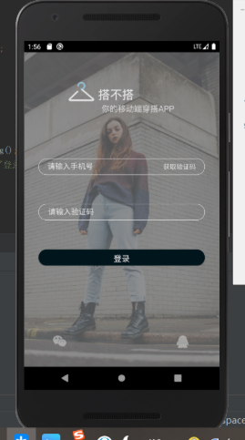

本周学习内容：  
  + 《第一行代码》看完了，把前四章和第六章的一些内容对着电脑敲了一遍加深印象；
  + 实践1做完，但是有些细节还是没有完全还原；  

下周学习计划：  
  + 开始学Android开发相关内容；
  + 把需要完成的demo任务看一下，了解需要哪些专业知识；  

遇到的问题：暂无  

成果展出：https://github.com/zhao1025  

在虚拟机上运行的的登录界面截图  
